### Introduction of AMBA
AMBA (Advanced Microcontroller Bus Architecture) is a standard for on-chip communication in system-on-chip (SoC) designs. It helps connect different components like processors, memory, and peripherals efficiently. It's widely used in embedded systems and mobile devices to streamline development and improve performance.

### History
AMBA was introduced by ARM in 1996. The first AMBA buses were the Advanced System Bus (`ASB`) and the Advanced Peripheral Bus (`APB`).
In its second version, AMBA 2 in 1999, ARM added AMBA High-performance Bus (`AHB`) that is a single clock-edge protocol.
In 2003, ARM introduced the third generation, AMBA 3, including Advanced eXtensible Interface (`AXI`) to reach even higher performance interconnect and the Advanced Trace Bus (`ATB`) as part of the CoreSight on-chip debug and trace solution.
In 2010, the AMBA 4 specifications were introduced starting with AMBA 4 AXI4, then
in 2011, extending system-wide coherency with AMBA 4 AXI Coherency Extensions (ACE).
In 2013, the AMBA 5 Coherent Hub Interface (`CHI`) specification was introduced, with a re-designed high-speed transport layer and features designed to reduce congestion.

Simple SoC

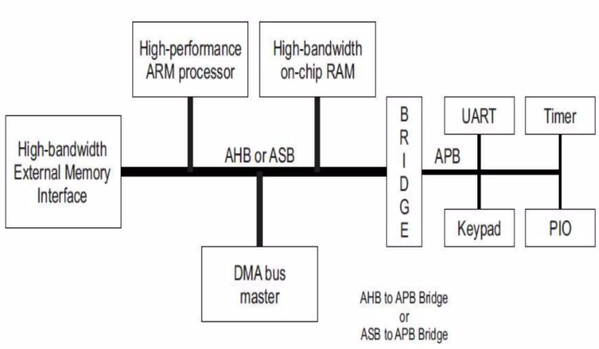


AHB is used to connect High Bandwidth components and uses a full duplex parallel communication with a pipelined strtcture. 

### APB
APB is used to interface low bandwidth peripherals like UART, Timers, GPIOs with Soc's processor/memory through bridge (which translates ABP-to-AHB).

The APB protocol is a low-cost interface, optimized for minimal power consumption and reduced interface
complexity. The APB interface is `not pipelined` and is a `simple`, `synchronous protocol`. Every transfer takes at least
`2 cycles` (*`Setup phase:address phase`* & *`Access Phase:data phase`*)to complete. 
The APB interface is designed for `accessing the programmable control registers of peripheral devices`. APB peripherals are typically connected to the main memory system using an APB bridge. This bridge translates the AHB to APB.


### APB Signals

| Signal         | Direction           | Description                                                                 |
|----------------|---------------------|-----------------------------------------------------------------------------|
| **PCLK**       | -                   | System clock; may be directly connected.                                   |
| **PRESETn**    | -                   | Active Low Asynchronous Reset.                                             |
| **PADDR[31:0]**| Master → Slave      | Address bus (up to 32 bits wide).                                          |
| **PWDATA[31:0]**| Master → Slave     | Write data bus (up to 32 bits wide).                                       |
| **PRDATA[31:0]**| Slave → Master     | Read data bus (up to 32 bits wide).                                        |
| **PSELx**      | Master → Slave      | Slave Select; one PSEL signal per slave (e.g., PSEL1, PSEL2,..., PSELn).   |
| **PENABLE**    | Master → Slave      | Indicates the second and subsequent cycles (ACCESS phase).                 |
| **PWRITE**     | Master → Slave      | High = Write operation, Low = Read operation.                              |
| **PREADY**     | Slave → Master      | Slave response signal; High = Ready, Low = Wait (wait states).             |
| **PSLVERR**    | Slave → Master      | Transfer status; High = Error, Low = Success.                              |

---

> An APB interface has a single address bus, `PADDR`, for read and write transfers.  
> It uses two independent data buses: one for read data (`PRDATA`) and one for write data (`PWDATA`).

---

### Operations
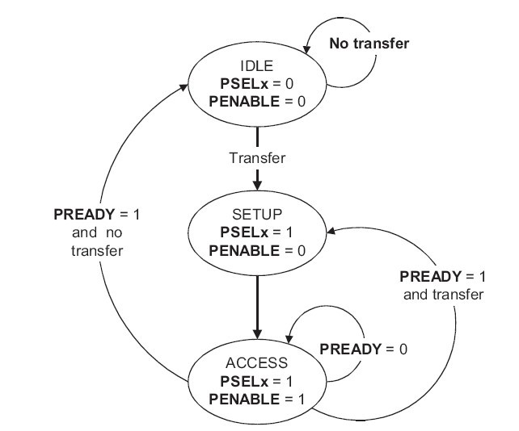

- **IDLE** : This is the default state of the APB.

- **SETUP:** When a transfer is required the bus moves into the SETUP state, where the appropriate select signal, **PSELx**, is asserted. The bus only remains in the SETUP state for one clock cycle and always moves to the ACCESS state on the next rising edge of the clock.

- **ACCESS**: The enable signal, PENABLE, is asserted in the ACCESS state. The address, write, select, and write data signals must remain stable during the transition from the SETUP to ACCESS state. Exit from the ACCESS state is controlled by the PREADY signal from the slave:

    - If **PREADY** is held LOW by the slave then the peripheral bus remains in the ACCESS state.
    - If **PREADY** is driven HIGH by the slave then the ACCESS state is exited and the bus returns to the IDLE state if no more transfers are required. Alternatively, the bus moves directly to the SETUP state if another transfer follows.
---
### Write & Read Transfer Operations

#### Write Transfer with no wait
<div style="display: flex;">
  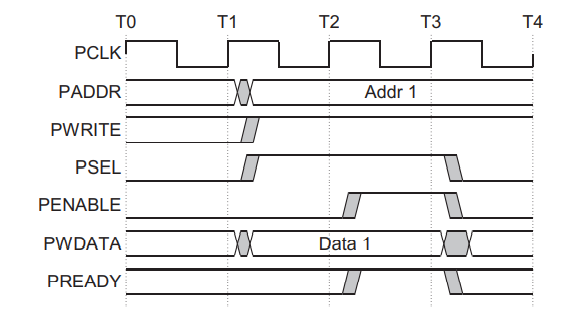
  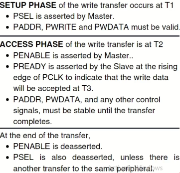
</div>

```bash
Time:        t1  t2  t3  t4
Clock:   ___┌>─┐_┌─┐_┌─┐_┌─┐___
PSEL:    ____┌─────────┐_____
PENABLE: ______┌───────┐_____
PWRITE:  ____┌─────────┐_____
PREADY:  ________┌─────┐_____
         IDLE SETUP ACCESS IDLE
-------------------------------------------------
-> Monitor Sample (When: PSEL && PENABLE && PWRITE (ACCESS phase)  
-> Transaction completes (when: PREADY=1)
```
#### Write Transfer with wait state
 <div style="display: flex;">
  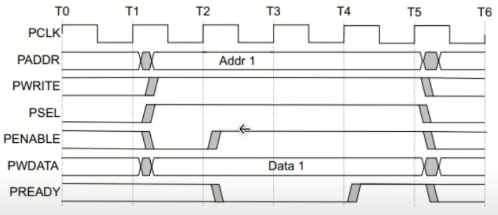
  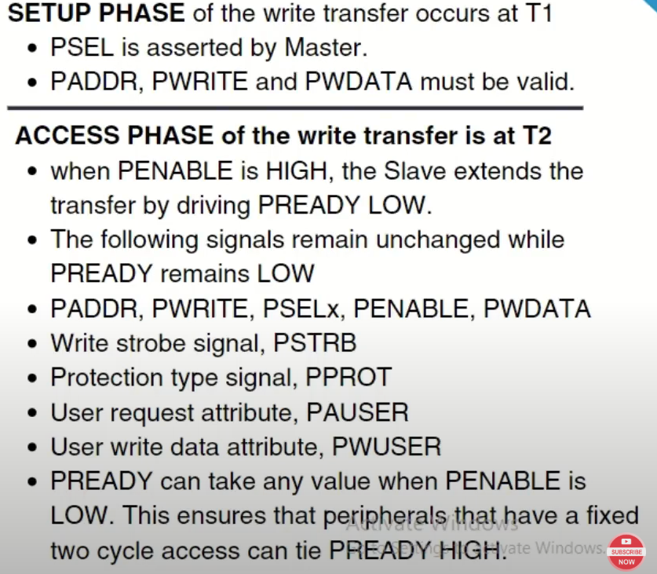
</div>
                           
 As seen in figure at during `T1` was the `setup phase` (as during this `PSEL=High`), during `T2` `Access Phase` (`PENBL=HIGH`) but here `PREADY=LOW` which causes delay during T3 & T4, At T5 it becomes high enabling transaction

#### Read Transfer without wait state
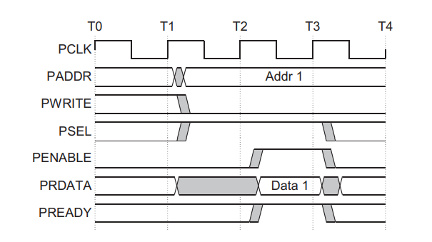

- During read operation the PENABLE, PSEL, PADDR PWRITE, signals are asserted at the clock edge T1 (SETUP cycle).

- At the clock edge T2, (ACCESS cycle), the PENABLE, PREADY are asserted and PRDATA is also read during this phase. The slave must provide the data before the end of the read transfer.
```bsh
Clock:    ___┌─┐_┌─┐_┌─┐_┌─┐___
PSEL:     ____┌─────────┐_____
PENABLE:  ______┌───────┐_____
PWRITE:   ______________________________ (0 for read)
PREADY:   ________┌─────┐_____
PRDATA:   ????????████████????? ← Valid only when PREADY=1
          IDLE SETUP ACCESS IDLE
                  ↑     ↑
              Sample    PRDATA 
              Address   Valid Here!
```

### Key difference between Write and Read
#### WRITE Operation:

- **Master drives data** → `PWDATA` is stable during entire ACCESS phase
- Can sample PWDATA anytime during ACCESS phase
- Data doesn't change based on PREADY
#### READ Operation:

- **Slave drives data** → `PRDATA` is only valid when PREADY=1
- Must wait for `PREADY` before sampling `PRDATA`
- PRDATA can be `garbage/X `before `PREADY `assertion

### Error Response

- PSLVERR shows an error during APB read/write transfers.
- It's valid only in the last cycle when PSEL, PENABLE, and PREADY are all high.
- An error may or may not change the peripheral's state.
- Either case is allowed, depending on the peripheral design.

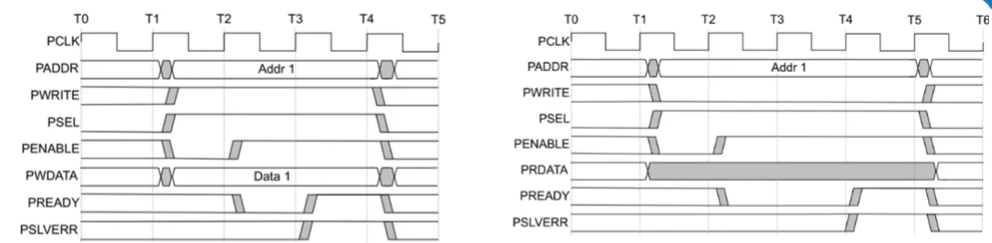

### Example Design:


#### Step-by-Step Flow

1. **Test starts**, and the `Seqs` are created and sent to the `Seqr`.
2. `Seqr` uses the UVM **TLM port** to pass transactions to the `Driver`.
3. `Driver` physically drives the **APB signals** to the `DUT` via a **virtual interface** (`vif`).
4. `W_monitor` taps into these signals (write side) and **publishes transactions** via:
   - `wap` → `cm_export_write` (Functional Coverage Model)
   - `wap` → `sb_export_write` (Scoreboard)
5. `R_monitor` observes DUT’s read responses and **publishes transactions** via:
   - `rap` → `cm_export_read` (Functional Coverage Model)
   - `rap` → `sb_export_read` (Scoreboard)
6. The **Scoreboard** compares the expected writes vs actual reads.
7. The **Coverage Model** tracks coverage metrics for protocol-level events.


#### TLM Interfaces 

| Port Type            | Direction        | Usage in Diagram                                 |
|----------------------|------------------|--------------------------------------------------|
| `tlm_analysis_port`  | broadcast out    | `W_monitor` and `R_monitor` (◇ diamonds)         |
| `tlm_analysis_export`| receive in       | `Scoreboard` and `Coverage Model` (🔘 circles)   |
| `tlm_port`           | master(initiator)| From `Seqr` to `Driver`                          |
| `tlm_imp`            | slave(responder) | Implemented in `Driver` to receive items         |

---
### Project flow
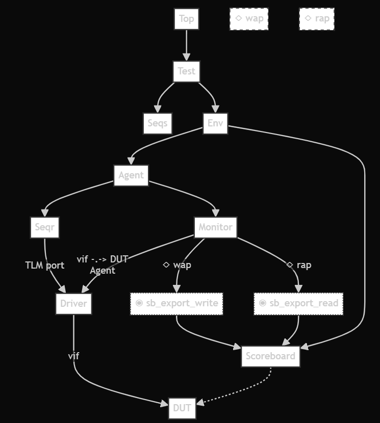


### Key Concepts Understanding

#### Monitor & Scoreboard Connections (TLM Ports)

```bash
       ENVIRONMENT
    ┌─────────────────────────┐
    │      AGENT              │
    │  ┌─────────────────┐    │    ┌──────────────┐
    │  │ SEQR ←TLM→ DRIVER    │    │              │
    │  └─────────────────┘    │    │  SCOREBOARD  │
    │                         │    │              │
    │  ┌─────────────────┐    │    │ • write_W()  │
    │  │    MONITOR      │──wap───→│ • write_R()  │
    │  │ • wr_phase()    │    │    │ • compare()  │
    │  │ • rd_phase()    │──rap───→│              │
    │  └─────────────────┘    │    └──────────────┘
    └─────────────────────────┘
            │ vif
        ┌───▼───┐
        │  DUT  │
        └───────┘
```
```bash
Monitor.wap ──────→ Scoreboard.sb_export_write
       📤                      📥
   (sends write)           (receives write)

Monitor.rap ──────→ Scoreboard.sb_export_read  
       📤                      📥
   (sends read)            (receives read)
```

`MONITOR (Sender Side)`
```sv
class monitor extends uvm_monitor;
    // PORTS - for sending data OUT
    uvm_analysis_port#(sequence_item) wap;  // Write Analysis Port
    uvm_analysis_port#(sequence_item) rap;  // Read Analysis Port
    
    // Usage: Send data to scoreboard
    wap.write(transaction);  // Send write transaction
    rap.write(transaction);  // Send read transaction
endclass
```
`SCOREBOARD (Receiver Side)`
```sv
class scoreboard extends uvm_scoreboard;
    // EXPORTS/IMPS - for receiving data IN
    uvm_analysis_imp_W #(sequence_item, scoreboard) sb_export_write;
    uvm_analysis_imp_R #(sequence_item, scoreboard) sb_export_read;
    
    // Functions that get called automatically when data arrives
    function void write_W(sequence_item trans);  // Handles write data
    function void write_R(sequence_item trans);  // Handles read data
endclass
```
`environment or agent (connect paths)`
```sv
monitor.wap.connect(scoreboard.sb_export_write);  // Connect write path
monitor.rap.connect(scoreboard.sb_export_read);   // Connect read path

```
#### Comparison Logic in Scoreboard
```bash
Write Queue: [100, 200, 300] ←── Data written to memory
Read Queue:  [100, 200, 300] ←── Data read from memory
             
Compare: 100==100?   //PASS
         200==200?  // PASS  
         300==300? //PASS
```
```sv
task run_phase(uvm_phase phase);
    forever begin
        @(posedge vif.PCLK) begin 
            // If both queues have data, compare them
            if(write_q.size() >0 && read_q.size() >0) begin 
                read  = read_q.pop_front();   // Get oldest read data
                write = write_q.pop_front();  // Get oldest write data
                compare();                    // Compare them
            end
        end
    end
endtask
```


#### Verbosity Level Control for Debugging
- Simulation commands with different verbosity
```sv
vsim +UVM_VERBOSITY=UVM_NONE     //Printed Always: only NONE messages //Critical info, final reports
vsim +UVM_VERBOSITY=UVM_LOW      //Default Level: NONE + LOW messages //Important events  
vsim +UVM_VERBOSITY=UVM_MEDIUM   //Medium Detail: NONE + LOW + MEDIUM //More detailed info 
vsim +UVM_VERBOSITY=UVM_HIGH     //High detail: NONE + LOW + MEDIUM + HIGH // Debug information
vsim +UVM_VERBOSITY=UVM_DEBUG    //Debug only: ALL messages // Detailed debug traces
```
- Activate detailed debugging by using this command in run.do file:
```bash
vsim +UVM_VERBOSITY=UVM_DEBUG
```

### UVM Hierarchy
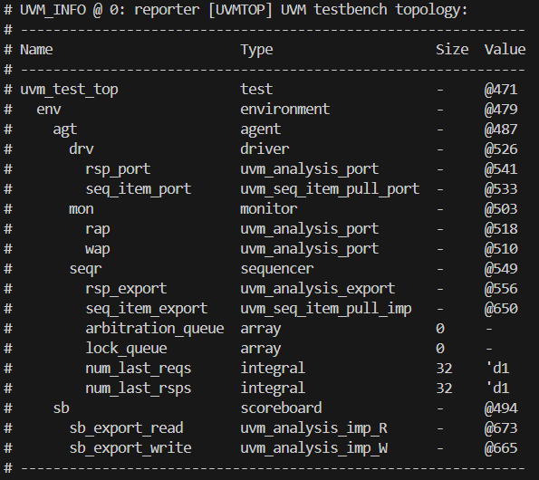

---

### Simulation Results
Waveforms for Read/Write Burst size of 8.

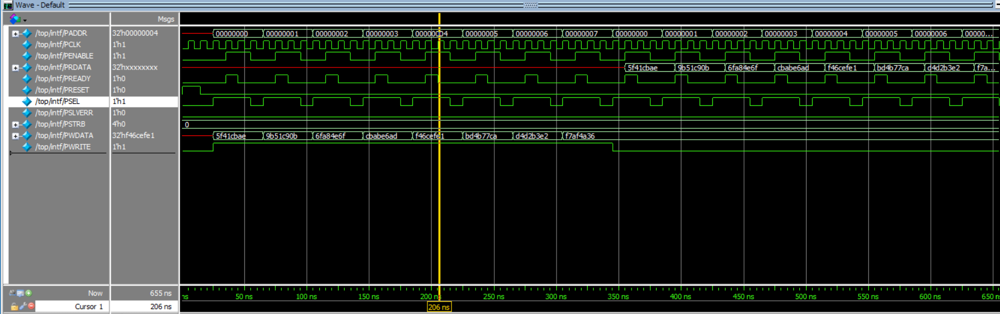

**Burst Test (sequence_one):**
- Runs 8 consecutive writes then 8 reads with incrementing addresses.
- Verifies burst transfer capability and data integrity.
- Sequence used: `sequence_one` (default burst sequence).

Waveforms of Simple single read/write 
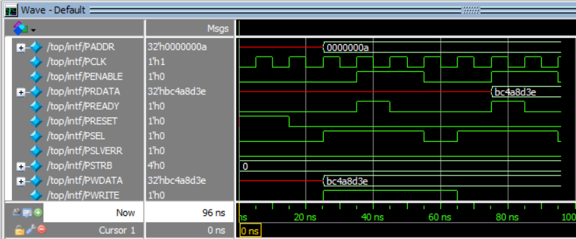

**Write/Read Test (write_read_sequence):**
- Performs a single write followed by a read to the same address.
- Checks basic write-read operation and data match.
- Sequence used: `write_read_sequence`.

Waveforms of Invalid Address
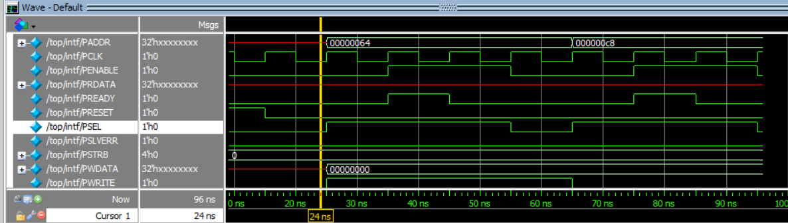

**Error Address Test (error_addr_sequence):**
- Issues transactions to out-of-range addresses (e.g., 100, 200).
- Verifies error signaling via PSLVERR for invalid accesses.
- Sequence used: `error_addr_sequence`.

### APB Protocol Sequence Analysis:
#### Burst Write Transaction (First Half):
Write Transaction Waveform:
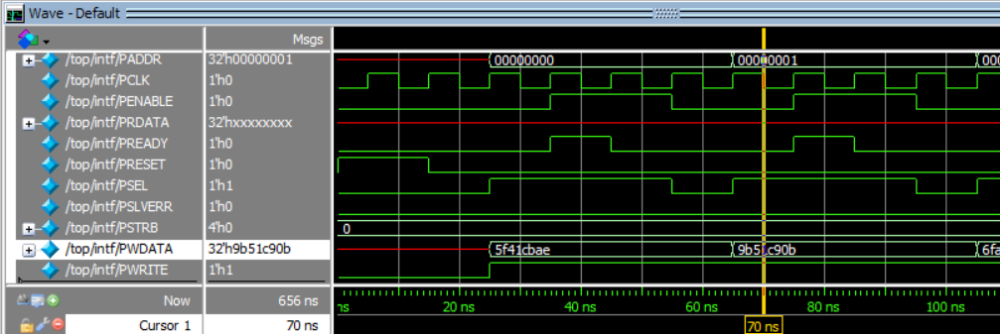
1. IDLE → SETUP (T3): PSEL=1, PENABLE=0, Address & Data driven (PADDR=0x0, PWDATA=0x5f41cbae)
2. SETUP → ACCESS (T4): PENABLE=1 asserted, all signals remain stable
3. ACCESS Complete: PREADY=1 from slave, transaction completes, return to IDLE
   
#### Burst Read Transaction (Second Half):
Read Transaction Waveform:
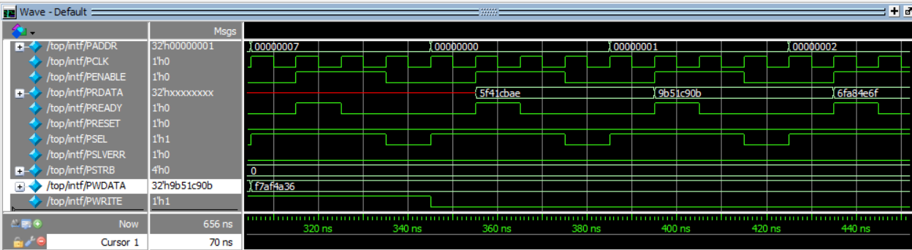
1. IDLE → SETUP (TA): PSEL=1, PENABLE=0, PWRITE=0, Address driven (PADDR=0x0)
2. SETUP → ACCESS (TB): PENABLE=1 asserted, wait for slave response
3. ACCESS Complete: PREADY=1, PRDATA=0x5f41cbae valid (same data written earlier)

### Scoreboard Output

`APB Burst Test`

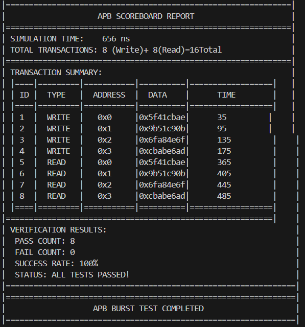

- Compares burst write and read data for all addresses.
- Ensures all burst transactions are correctly verified.
- Sequence: `sequence_one`.


`APB Write/Read Test`

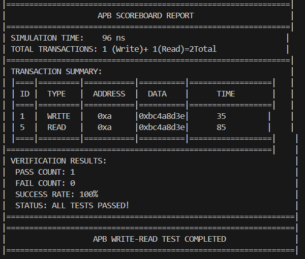

- Checks single write and read data match at the same address.
- Confirms correct data flow for basic operation.
- Sequence: `write_read_sequence`.


`APB Error Address Test`

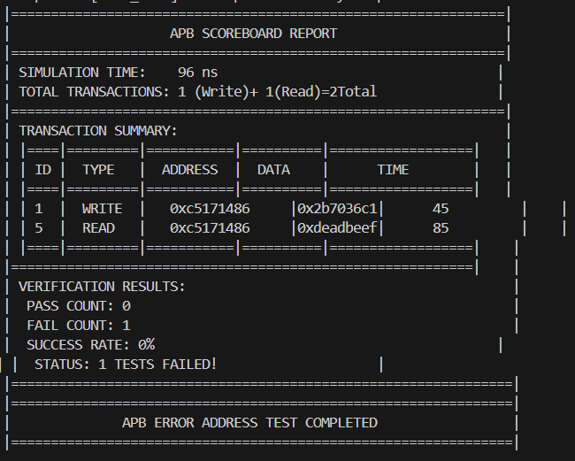

- Shows error detection for invalid address accesses.
- PSLVERR is asserted as expected for out-of-range addresses.
- Sequence: `error_addr_sequence`.

---

### Source Files List
```bash
# All SystemVerilog and script files in src/
agent.sv
scoreboard.sv
driver.sv
design.sv
environment.sv
interface.sv
monitor.sv
pkg.sv
run.do
sequence.sv
sequence_item.sv
test.sv
top.sv
write_read_sequence.sv
error_addr_sequence.sv
sequencer.sv
```
---

#### Key Observations:
1. Burst transfers are correctly handled, with all write and read data matching across multiple addresses, confirming robust burst support.
2. Single write/read operations show perfect data integrity, validating basic APB functionality and correct address/data handling.
3. Error address tests successfully trigger PSLVERR for out-of-range addresses, demonstrating proper error detection and protocol compliance.
4. PREADY signal behavior is consistent, ensuring transactions only complete when the slave is ready, as per APB specification.
5. Scoreboard comparisons pass for all valid cases, confirming the correctness of both the DUT and the verification environment.
6. Waveforms clearly illustrate the expected APB transaction phases (IDLE, SETUP, ACCESS) for all test scenarios.
7. Testbench flexibility allows easy switching between burst, single, and error tests, supporting comprehensive protocol coverage and future extensions.
---
### References
- Design:
  https://github.com/kumarraj5364/AMBA-APB-PROTOCOL?tab=readme-ov-file
- Design & Verification: https://github.com/PRADEEPCHANGAL/APB-Protocol-Verification-using-UVM
  
---

### How to Run the Simulation

1. **Open a terminal and navigate to the project directory:**
   - First, go to the `APB_UVM_Advance` folder, then into `src`:

```bash
cd APB_UVM_Advance
cd src
```

2. **Run the simulation in command-line mode (text results only):**

```bash
vsim -c -do run.do
```

3. **Run the simulation with GUI for waveforms (QuestaSim):**

```bash
vsim -do run.do
```

4. **To run a different test case:**
   - Open `run.do` in a text editor.
   - Uncomment the line for the desired test (e.g., `write_read_test` or `error_addr_test`) and comment out the default line if needed.
   - Only one `vsim ... +UVM_TESTNAME=...` line should be active at a time.

5. **View waveforms:**
   - If you used the GUI command, waveforms will be displayed automatically.
   - You can inspect signal activity and verify protocol behavior visually.

---
