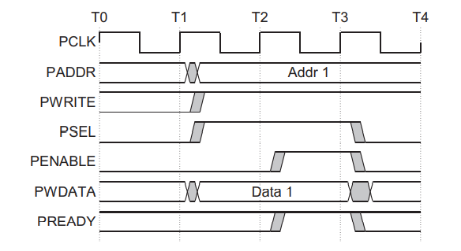
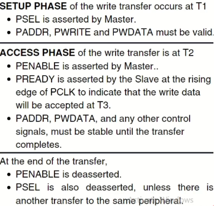
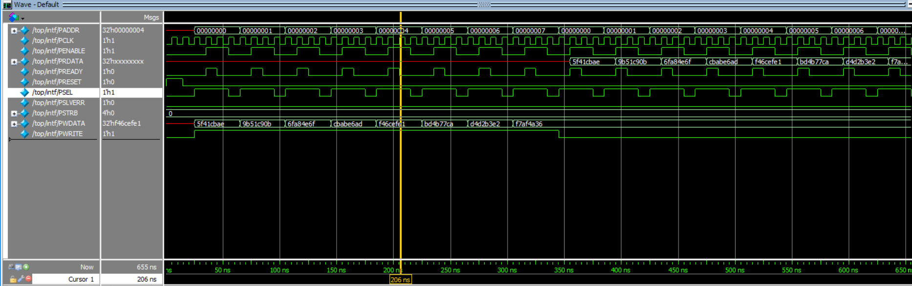

### Introduction of AMBA
AMBA (Advanced Microcontroller Bus Architecture) is a standard for on-chip communication in system-on-chip (SoC) designs. It helps connect different components like processors, memory, and peripherals efficiently. It's widely used in embedded systems and mobile devices to streamline development and improve performance.

### History
AMBA was introduced by ARM in 1996. The first AMBA buses were the Advanced System Bus (`ASB`) and the Advanced Peripheral Bus (`APB`).
In its second version, AMBA 2 in 1999, ARM added AMBA High-performance Bus (`AHB`) that is a single clock-edge protocol.
In 2003, ARM introduced the third generation, AMBA 3, including Advanced eXtensible Interface (`AXI`) to reach even higher performance interconnect and the Advanced Trace Bus (`ATB`) as part of the CoreSight on-chip debug and trace solution.
In 2010, the AMBA 4 specifications were introduced starting with AMBA 4 AXI4, then
in 2011, extending system-wide coherency with AMBA 4 AXI Coherency Extensions (ACE).
In 2013, the AMBA 5 Coherent Hub Interface (`CHI`) specification was introduced, with a re-designed high-speed transport layer and features designed to reduce congestion.

Simple SoC

AHB is used to connect High Bandwidth components and uses a full duplex parallel communication with a pipelined strtcture. 

### APB
APB is used to interface low bandwidth peripherals like UART, Timers, GPIOs with Soc's processor/memory through bridge (which translates ABP-to-AHB).

The APB protocol is a low-cost interface, optimized for minimal power consumption and reduced interface
complexity. The APB interface is `not pipelined` and is a `simple`, `synchronous protocol`. Every transfer takes at least
`2 cycles` (*`Setup phase:address phase`* & *`Access Phase:data phase`*)to complete. 
The APB interface is designed for `accessing the programmable control registers of peripheral devices`. APB peripherals are typically connected to the main memory system using an APB bridge. This bridge translates the AHB to APB.

### APB Signals

| Signal         | Direction           | Description                                                                 |
|----------------|---------------------|-----------------------------------------------------------------------------|
| **PCLK**       | -                   | System clock; may be directly connected.                                   |
| **PRESETn**    | -                   | Active Low Asynchronous Reset.                                             |
| **PADDR[31:0]**| Master → Slave      | Address bus (up to 32 bits wide).                                          |
| **PWDATA[31:0]**| Master → Slave     | Write data bus (up to 32 bits wide).                                       |
| **PRDATA[31:0]**| Slave → Master     | Read data bus (up to 32 bits wide).                                        |
| **PSELx**      | Master → Slave      | Slave Select; one PSEL signal per slave (e.g., PSEL1, PSEL2,..., PSELn).   |
| **PENABLE**    | Master → Slave      | Indicates the second and subsequent cycles (ACCESS phase).                 |
| **PWRITE**     | Master → Slave      | High = Write operation, Low = Read operation.                              |
| **PREADY**     | Slave → Master      | Slave response signal; High = Ready, Low = Wait (wait states).             |
| **PSLVERR**    | Slave → Master      | Transfer status; High = Error, Low = Success.                              |

---

> An APB interface has a single address bus, `PADDR`, for read and write transfers.  
> It uses two independent data buses: one for read data (`PRDATA`) and one for write data (`PWDATA`).

---

### Operations

- **IDLE** : This is the default state of the APB.

- **SETUP:** When a transfer is required the bus moves into the SETUP state, where the appropriate select signal, **PSELx**, is asserted. The bus only remains in the SETUP state for one clock cycle and always moves to the ACCESS state on the next rising edge of the clock.

- **ACCESS**: The enable signal, PENABLE, is asserted in the ACCESS state. The address, write, select, and write data signals must remain stable during the transition from the SETUP to ACCESS state. Exit from the ACCESS state is controlled by the PREADY signal from the slave:

    - If **PREADY** is held LOW by the slave then the peripheral bus remains in the ACCESS state.
    - If **PREADY** is driven HIGH by the slave then the ACCESS state is exited and the bus returns to the IDLE state if no more transfers are required. Alternatively, the bus moves directly to the SETUP state if another transfer follows.
---
### Write & Read Transfer Operations

#### Write Transfer with no wait

  
  

#### Write Transfer with wait state
 

  
  

                           
 As seen in figure at during `T1` was the `setup phase` (as during this `PSEL=High`), during `T2` `Access Phase` (`PENBL=HIGH`) but here `PREADY=LOW` which causes delay during T3 & T4, At T5 it becomes high enabling transaction

#### Read Transfer without wait state

- During read operation the PENABLE, PSEL, PADDR PWRITE, signals are asserted at the clock edge T1 (SETUP cycle).

- At the clock edge T2, (ACCESS cycle), the PENABLE, PREADY are asserted and PRDATA is also read during this phase. The slave must provide the data before the end of the read transfer.

### Error Response

- PSLVERR shows an error during APB read/write transfers.
- It's valid only in the last cycle when PSEL, PENABLE, and PREADY are all high.
- An error may or may not change the peripheral's state.
- Either case is allowed, depending on the peripheral design.

### Example Design:

#### Step-by-Step Flow

1. **Test starts**, and the `Seqs` are created and sent to the `Seqr`.
2. `Seqr` uses the UVM **TLM port** to pass transactions to the `Driver`.
3. `Driver` physically drives the **APB signals** to the `DUT` via a **virtual interface** (`vif`).
4. `W_monitor` taps into these signals (write side) and **publishes transactions** via:
   - `wap` → `cm_export_write` (Functional Coverage Model)
   - `wap` → `sb_export_write` (Scoreboard)
5. `R_monitor` observes DUT’s read responses and **publishes transactions** via:
   - `rap` → `cm_export_read` (Functional Coverage Model)
   - `rap` → `sb_export_read` (Scoreboard)
6. The **Scoreboard** compares the expected writes vs actual reads.
7. The **Coverage Model** tracks coverage metrics for protocol-level events.

#### TLM Interfaces 

| Port Type            | Direction        | Usage in Diagram                                |
|----------------------|------------------|--------------------------------------------------|
| `tlm_analysis_port`  | broadcast out    | `W_monitor` and `R_monitor` (◇ diamonds)         |
| `tlm_analysis_export`| receive in       | `Scoreboard` and `Coverage Model` (🔘 circles)   |
| `tlm_port`           | master (initiator)| From `Seqr` to `Driver`                         |
| `tlm_imp`            | slave (responder)| Implemented in `Driver` to receive items         |

---
### Project flow

---

### Simulation Results
Waveforms for Read/Write Burst size of 8.

- link-1:
https://youtu.be/yFyVwOw6FhQ?si=OQ5I0CWuqm3YPTCd

- 2-parts: 
https://youtu.be/qa5ct8AgFTM?si=8lyBKGg0muI1TsRA

- design:
  https://github.com/kumarraj5364/AMBA-APB-PROTOCOL?tab=readme-ov-file
- Github: https://github.com/PRADEEPCHANGAL/APB-Protocol-Verification-using-UVM
  
---
